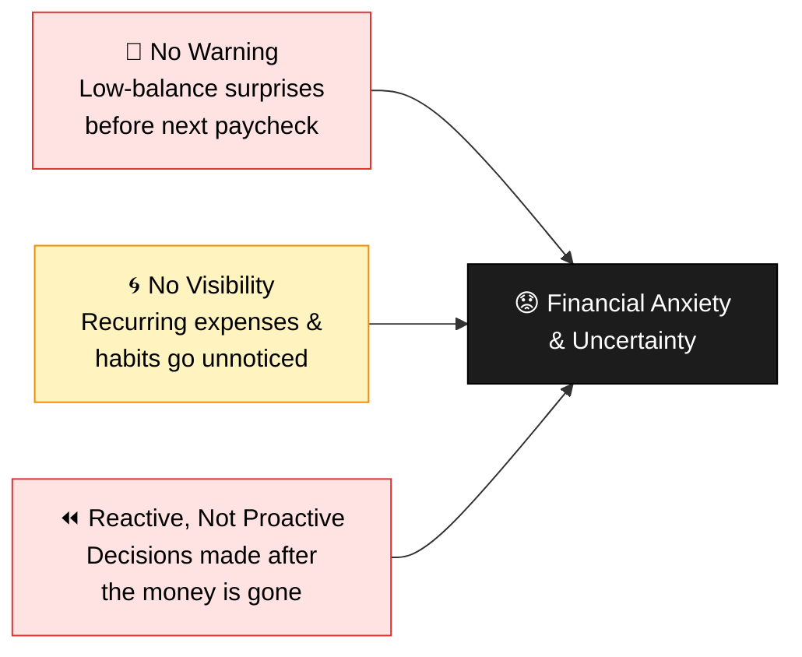
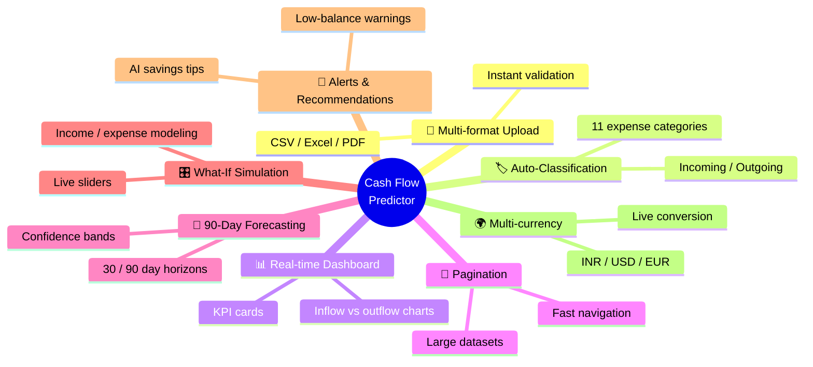
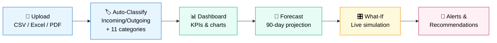
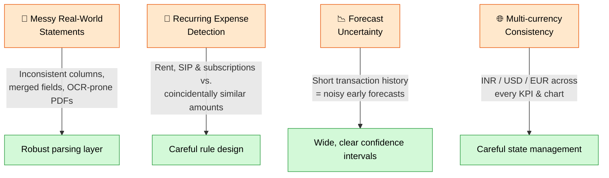
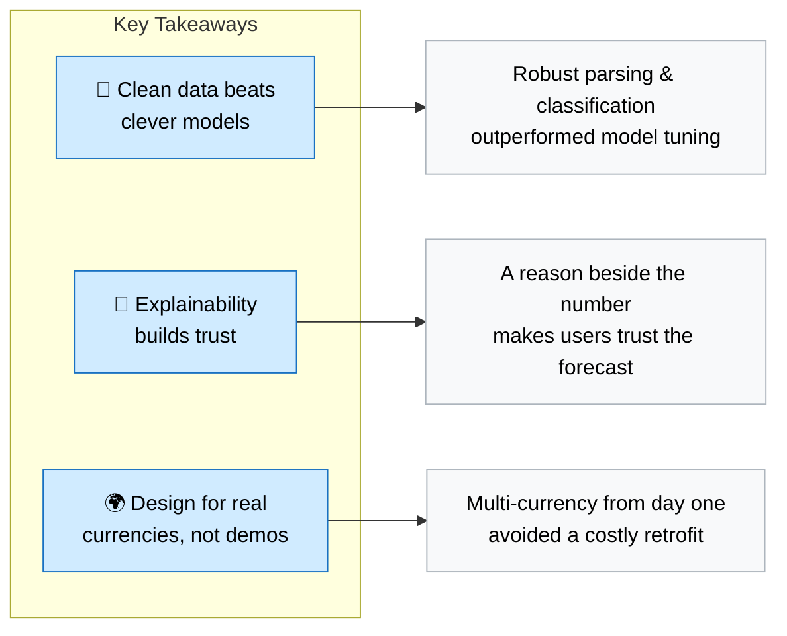

# Personal Cash Flow Predictor

> **Know your money before it moves.**
> AI-powered forecasting, spending intelligence & savings recommendations.

Personal Cash Flow Predictor turns raw bank statements into a forward-looking view of your finances — so you can see a low-balance week coming, understand *why* it's coming, and act before it happens.

---

## Table of Contents

- [Project Overview](#project-overview)
- [Problem Statement](#problem-statement)
- [Why It Matters](#why-it-matters)
- [Features](#features)
- [Demo Walkthrough](#demo-walkthrough)
- [Architecture](#architecture)
- [Technology Stack](#technology-stack)
- [AI Components](#ai-components)
- [Model Performance & Metrics](#model-performance--metrics)
- [Challenges Faced](#challenges-faced)
- [What We Learned](#what-we-learned)
- [Future Enhancements](#future-enhancements)

---

## Project Overview

Most people can't answer a simple question: **"Will I have enough money next month?"**

Banking apps show what already happened. Spreadsheets are manual and quickly go stale. Nothing connects past transactions to a forward-looking view of cash flow.

Personal Cash Flow Predictor closes that gap. Upload a bank statement, and the system automatically classifies every transaction, builds a 90-day balance forecast, and surfaces plain-language insights and savings opportunities — turning financial anxiety into financial confidence.

## Problem Statement

- **Low-balance surprises** — Unexpected shortfalls arrive before the next paycheck, with no warning.
- **No visibility into patterns** — Recurring expenses and spending habits go unnoticed month after month.
- **Reactive, not proactive** — Decisions get made after the money is already gone, not before.

## Why It Matters

Financial stress is rarely about income alone — it's about uncertainty. Giving people a forward-looking view turns financial anxiety into financial confidence.

| Principle | Description |
|---|---|
| **Act before it's too late** | Forecasting low balances days in advance gives people time to adjust spending, not just react after an overdraft. |
| **Save without the spreadsheet** | Automated pattern detection finds savings opportunities people would never spot manually. |
| **Built for real life** | Supports multiple currencies and real bank statement formats, not just toy demo data. |

## Features

- 📂 **Multi-format upload** — drag-and-drop CSV, Excel, or PDF bank statements, with instant column validation
- 🏷️ **Automatic transaction classification** — every transaction tagged Incoming/Outgoing and sorted into 11 expense categories
- 📊 **Real-time dashboard** — KPI cards, inflow vs. outflow charts, and category breakdowns
- 📄 **Pagination support** — Large transaction datasets are split into manageable pages, improving navigation, reducing load times, and enhancing overall user experience.
- 🔮 **90-day forecasting** — balance projections with confidence bands, supporting 90-day horizons
- 🎛️ **What-if simulation** — sliders to model income changes, expense cuts, or one-time purchases live
- 🔔 **Alerts & Recommendations** — automatic low-balance warnings and AI-generated savings recommendations
- 🌍 **Multi-currency support** — INR, USD, and EUR with live conversion

## Demo Walkthrough

The product flows through six stages, from raw statement to actionable insight:

1. **Upload** — Drag-and-drop a CSV, Excel, or PDF bank statement; columns are validated instantly.
2. **Auto-Classify** — Every transaction is tagged Incoming/Outgoing and sorted into 11 expense categories.
3. **Dashboard** — KPI cards, inflow vs. outflow charts, and a category breakdown update in real time.
4. **Forecast** — A 90-day forecast with confidence bands shows where the balance is headed.
5. **What-If** — Sliders simulate income changes, expense cuts, or one-time purchases live.
6. **Alerts & Recommendations** — Low-balance warnings and AI savings recommendations surface automatically.

## Architecture

The system is organized as a clean pipeline: every transaction is classified (incoming/outgoing + category) automatically on upload, so forecasting and recommendations always work off clean, structured data.

- **Design principle:** Classify every transaction (incoming/outgoing + category) automatically on upload, so downstream forecasting and recommendations always operate on clean, structured data.
- **Multi-Agent Architecture:** The system follows a multi-agent architecture where specialized agents handle transaction classification, forecasting, insight generation, and recommendation tasks independently while collaborating through the API layer.
- **SDD (Spec-Driven Development):** Requirements, workflows, and system behavior are defined through detailed specifications before implementation, improving consistency, scalability, and development efficiency.

## Technology Stack

| Layer               | Technology                                  |
| ------------------- | ------------------------------------------- |
| Frontend            | Lovable.dev, React, Tailwind CSS, shadcn/ui |
| Backend             | Python, FastAPI                             |
| Database            | PostgreSQL                                  |
| Document Processing | PDFPlumber                                  |
| Forecasting         | Prophet                                     |
| AI                  | OpenAI APIs                                 |
| API Testing         | Postman                                     |
| Server              | Uvicorn                                     |
| Testing             | Playwright                                  |
| Deployment          | Render                                      |

## AI Components

- **Forecasting Engine** — Uses Prophet / ARIMA time-series models to project account balances 30 or 90 days into the future, with confidence bands that widen further out and narrow as new transactions arrive.
- **AI Insight Service** — Uses OpenAI APIs to generate plain-language explanations of forecasts and personalized savings recommendations, so users understand *why* a forecast looks the way it does, not just the number itself.
- **Transaction Classification** — Automatically extracts and classifies every transaction into one of 11 expense categories on upload, forming the structured data foundation that forecasting and AI insights are built on.
- **Scenario Simulator** — Uses natural-language inputs to evaluate "what-if" financial scenarios, generating an updated cash flow forecast, 90-day impact analysis, risk assessment, and actionable recommendations.
  
## Model Performance & Metrics

**ML Model Metrics** — Model performance is evaluated using forecast accuracy, classification quality, prediction confidence intervals, and validation against historical transaction data.

Forecast accuracy is benchmarked using the following error metrics:

- 📏 **Mean Absolute Error (MAE)** — average magnitude of forecast errors, in the same units as the balance itself
- 📐 **Root Mean Squared Error (RMSE)** — penalizes larger forecast misses more heavily than small ones
- 🧮 **Mean Squared Error (MSE)** — squared error term used internally for model tuning and comparison
- ⚖️ **Mean Absolute Scaled Error (MASE)** — compares forecast error against a naive baseline, making accuracy comparable across users with different spending scales

**Evaluation approach:** Forecast accuracy is validated by comparing predicted vs. actual balances on held-out historical weeks; classification accuracy is checked against manually labeled sample transactions. The confidence band on the 90-day forecast widens further into the future and narrows as new transactions arrive.

## Challenges Faced

- **Messy real-world statements** — Bank PDFs vary wildly in layout; parsing had to handle inconsistent columns, merged fields, and OCR-prone formats.
- **Recurring expense detection** — Distinguishing genuine recurring charges (rent, SIP, subscriptions) from coincidentally similar amounts needed careful rule design.
- **Forecast uncertainty** — Short transaction histories early on made early forecasts noisy; confidence intervals had to be wide and clearly communicated.
- **Multi-currency consistency** — Keeping every KPI, chart, and recommendation in sync across INR, USD, and EUR without mixed symbols took careful state management.

## What We Learned

- **Clean data beats clever models** — Time spent on robust parsing and classification paid off more than tuning the forecasting model itself.
- **Explainability builds trust** — Users trust a forecast more when it comes with a plain-language reason, not just a number.
- **Design for real currencies, not demos** — Building multi-currency support from day one avoided a costly retrofit later.
  
## Future Enhancements

- 💬 **Conversational financial assistant** — Let users ask questions in plain English and get grounded answers from their own data.
- 🚨 **Anomaly detection** — Flag unusual transactions automatically, beyond simple low-balance alerts.
- 🏦 **Multi-account support** — Aggregate checking, savings, and credit accounts into one unified forecast.
- 🎯 **Goal-based savings plans** — Let users set a target (e.g. a trip or down payment) and get a tailored plan to reach it.
- 📉 **Subscription optimization** — Surface underused subscriptions and suggest cancellations automatically.

---

*Personal Cash Flow Predictor — Team Project.*
