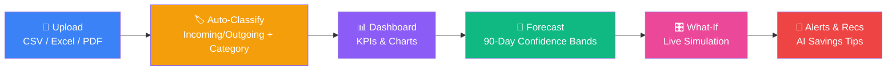
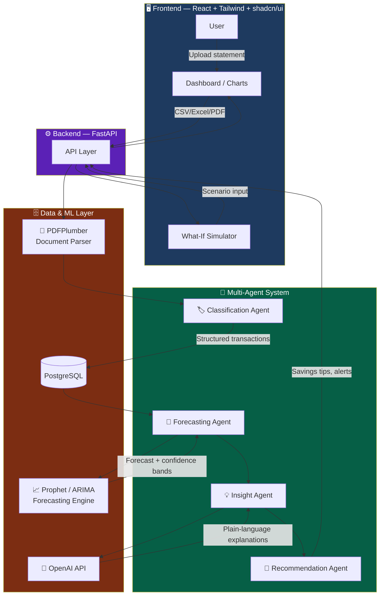

# 💸 Personal Cash Flow Predictor

### Know your money before it moves.

**AI-powered forecasting, spending intelligence & savings recommendations — built from raw bank statements.**

---

Personal Cash Flow Predictor turns raw bank statements into a **forward-looking view of your finances** — so you can see a low-balance week coming, understand *why* it's coming, and act before it happens.

  
  
  
  
  
  
  

---

## 📑 Table of Contents

- [Project Overview](#-project-overview)
- [Problem Statement](#-problem-statement)
- [Why It Matters](#-why-it-matters)
- [Features](#-features)
- [Demo Walkthrough](#-demo-walkthrough)
- [Architecture](#-architecture)
- [Technology Stack](#-technology-stack)
- [AI Components](#-ai-components)
- [UX & Frontend Optimizations](#-ux--frontend-optimizations)
- [Model Performance & Metrics](#-model-performance--metrics)
- [Challenges Faced](#-challenges-faced)
- [What We Learned](#-what-we-learned)
- [Future Enhancements](#-future-enhancements)

---

## 🧭 Project Overview

Most people can't answer a simple question:

> **"Will I have enough money next month?"**

Banking apps show what already happened. Spreadsheets are manual and quickly go stale. Nothing connects past transactions to a forward-looking view of cash flow.

**Personal Cash Flow Predictor closes that gap.** Upload a bank statement, and the system automatically classifies every transaction, builds a 90-day balance forecast, and surfaces plain-language insights and savings opportunities — turning financial anxiety into financial confidence.

---

## ❗ Problem Statement

| | Pain Point | Impact |
|---|---|---|
| 🚨 | **Low-balance surprises** | Unexpected shortfalls arrive before the next paycheck, with no warning |
| 🔍 | **No visibility into patterns** | Recurring expenses and spending habits go unnoticed month after month |
| ⏳ | **Reactive, not proactive** | Decisions get made *after* the money is already gone, not before |

---

## 💡 Why It Matters

> Financial stress is rarely about income alone — it's about **uncertainty**. Giving people a forward-looking view turns financial anxiety into financial confidence.

| Principle | Description |
|---|---|
| ⏰ **Act before it's too late** | Forecasting low balances days in advance gives people time to adjust spending, not just react after an overdraft |
| 🐷 **Save without the spreadsheet** | Automated pattern detection finds savings opportunities people would never spot manually |
| 🌍 **Built for real life** | Supports multiple currencies and real bank statement formats, not just toy demo data |

---

## ✨ Features

<table>
<tr>
<td width="50%">

**📂 Multi-format upload**
Drag-and-drop CSV, Excel, or PDF bank statements, with instant column validation

**🏷️ Automatic transaction classification**
Every transaction tagged Incoming/Outgoing and sorted into 11 expense categories

**📊 Real-time dashboard**
KPI cards, inflow vs. outflow charts, and category breakdowns

**📄 Pagination support**
Large transaction datasets are split into manageable pages for smoother navigation

</td>
<td width="50%">

**🔮 90-day forecasting**
Balance projections with confidence bands, supporting 30/90-day horizons

**🎛️ What-if simulation**
Sliders to model income changes, expense cuts, or one-time purchases live

**🔔 Alerts & Recommendations**
Automatic low-balance warnings and AI-generated savings recommendations

**🌍 Multi-currency support**
INR, USD, and EUR with live conversion

</td>
</tr>
</table>

---

## 🎬 Demo Walkthrough

The product flows through six stages, from raw statement to actionable insight:

<strong>📝 Step-by-step description</strong>

1. **Upload** — Drag-and-drop a CSV, Excel, or PDF bank statement; columns are validated instantly.
2. **Auto-Classify** — Every transaction is tagged Incoming/Outgoing and sorted into 11 expense categories.
3. **Dashboard** — KPI cards, inflow vs. outflow charts, and a category breakdown update in real time.
4. **Forecast** — A 90-day forecast with confidence bands shows where the balance is headed.
5. **What-If** — Sliders simulate income changes, expense cuts, or one-time purchases live.
6. **Alerts & Recommendations** — Low-balance warnings and AI savings recommendations surface automatically.

---

## 🏗️ Architecture

**Design principle:** Classify every transaction (incoming/outgoing + category) automatically on upload, so downstream forecasting and recommendations always operate on clean, structured data.

The system follows a **multi-agent architecture** — specialized agents independently handle classification, forecasting, insight generation, and recommendations, collaborating through a shared API layer. Requirements and workflows are defined up front using **Spec-Driven Development (SDD)**, improving consistency, scalability, and development efficiency.

### System Data Flow

### 🤖 Multi-Agent System — Component Breakdown

| Agent / Component | Role |
|---|---|
| 🏷️ **Classification Agent** | Parses incoming statements and tags each transaction as Incoming/Outgoing, sorting it into one of 11 expense categories — the structured foundation everything else builds on |
| 🔮 **Forecasting Agent** | Feeds clean transaction data into Prophet/ARIMA models to project account balances 30–90 days out, with confidence bands |
| 💡 **Insight Agent** | Calls the OpenAI API to translate raw forecast numbers into plain-language explanations of *why* the forecast looks the way it does |
| 🎯 **Recommendation Agent** | Analyzes spending patterns and forecast risk to generate personalized, actionable savings recommendations and low-balance alerts |
| 📐 **SDD (Spec-Driven Development)** | Not a runtime agent, but the development backbone — every agent's behavior, API contract, and workflow is specified in detail *before* implementation, keeping the multi-agent system consistent and easy to extend |

> 💬 **Why multi-agent?** Each agent has a single, well-defined responsibility and communicates through the API layer rather than sharing internal state. This keeps classification, forecasting, explanation, and recommendation logic independently testable and replaceable.

---

## 🛠️ Technology Stack

| Layer | Technology |
|---|---|
| 🎨 **Frontend** | Lovable.dev · React · Tailwind CSS · shadcn/ui |
| ⚙️ **Backend** | Python · FastAPI |
| 🗄️ **Database** | PostgreSQL |
| 📄 **Document Processing** | PDFPlumber |
| 🔮 **Forecasting** | Prophet |
| 🧠 **AI** | OpenAI APIs |
| 🧪 **API Testing** | Postman |
| 🚀 **Server** | Uvicorn |
| ✅ **Testing** | Playwright |
| ☁️ **Deployment** | Render |

---

## 🧠 AI Components

| Component | Description |
|---|---|
| 📈 **Forecasting Engine** | Uses Prophet / ARIMA time-series models to project account balances 30 or 90 days into the future, with confidence bands that widen further out and narrow as new transactions arrive |
| 💡 **AI Insight Service** | Uses OpenAI APIs to generate plain-language explanations of forecasts and personalized savings recommendations, so users understand *why* a forecast looks the way it does, not just the number itself |
| 🏷️ **Transaction Classification** | Automatically extracts and classifies every transaction into one of 11 expense categories on upload, forming the structured data foundation that forecasting and AI insights are built on |
| 🎛️ **Scenario Simulator** | Uses natural-language inputs to evaluate "what-if" financial scenarios, generating an updated cash flow forecast, 90-day impact analysis, risk assessment, and actionable recommendations |

---

## 🎨 UX & Frontend Optimizations

<table>
<tr>
<td width="50%" valign="top">

### 📄 Pagination
Large transaction datasets are split into manageable pages instead of one long scroll.

- ⚡ Faster initial load on large statements
- 🧭 Easier navigation through months of transactions
- 🖱️ Smoother browsing experience overall

</td>
<td width="50%" valign="top">

### 🧩 Other UX Optimizations
Small touches that add up to a polished feel.

- 📊 Real-time KPI & chart updates as data loads
- 🎛️ Live what-if sliders with instant visual feedback
- 🌍 Consistent currency formatting across all views
- 🔔 Inline alerts instead of disruptive pop-ups

</td>
</tr>
</table>

> ✅ **Result:** Even with months of transaction history, the dashboard stays fast, readable, and easy to navigate — pagination keeps the UI responsive without hiding data.

---

## 📊 Model Performance & Metrics

**Evaluation approach:** Forecast accuracy is validated by comparing predicted vs. actual balances on held-out historical weeks; classification accuracy is checked against manually labeled sample transactions. The confidence band on the 90-day forecast widens further into the future and narrows as new transactions arrive.

| 📏 Metric | Description |
|---|---|
| **MAE** — Mean Absolute Error | Average absolute difference between predicted and actual balances; easy to interpret in real currency units |
| **RMSE** — Root Mean Squared Error | Penalizes larger forecast misses more heavily, highlighting how the model performs during volatile spending periods |
| **MSE** — Mean Squared Error | The squared average error term underlying RMSE; useful for comparing model variants during tuning |
| **MASE** — Mean Absolute Scaled Error | Compares forecast error against a naive baseline, showing how much better the model is than simply assuming "no change" |

> 📌 **Why these four together?** MAE and MSE/RMSE describe *how big* the typical error is, while MASE answers the more important question — *is the forecast actually better than a naive guess?* Using all four avoids over-trusting a single metric.

📐 <strong>Other system metrics</strong>

| Metric | Value |
|---|---|
| Expense categories auto-classified | **11** |
| Forecast horizons supported | **30 / 90 days** |
| Currencies with live conversion | **3** (INR, USD, EUR) |
| File formats accepted | **3** (CSV, Excel, PDF) |

---

## 🧩 Challenges Faced

<strong>📄 Messy real-world statements</strong>

 
Bank PDFs vary wildly in layout; parsing had to handle inconsistent columns, merged fields, and OCR-prone formats.

<strong>🔁 Recurring expense detection</strong>

 
Distinguishing genuine recurring charges (rent, SIP, subscriptions) from coincidentally similar amounts needed careful rule design.

<strong>📉 Forecast uncertainty</strong>

 
Short transaction histories early on made early forecasts noisy; confidence intervals had to be wide and clearly communicated.

<strong>🌍 Multi-currency consistency</strong>

 
Keeping every KPI, chart, and recommendation in sync across INR, USD, and EUR without mixed symbols took careful state management.

---

## 🎓 What We Learned

| Lesson | Takeaway |
|---|---|
| 🧹 **Clean data beats clever models** | Time spent on robust parsing and classification paid off more than tuning the forecasting model itself |
| 🤝 **Explainability builds trust** | Users trust a forecast more when it comes with a plain-language reason, not just a number |
| 🌍 **Design for real currencies, not demos** | Building multi-currency support from day one avoided a costly retrofit later |

---

## 🚀 Future Enhancements

- 💬 **Conversational financial assistant** — Let users ask questions in plain English and get grounded answers from their own data
- 🚨 **Anomaly detection** — Flag unusual transactions automatically, beyond simple low-balance alerts
- 🏦 **Multi-account support** — Aggregate checking, savings, and credit accounts into one unified forecast
- 🎯 **Goal-based savings plans** — Let users set a target (e.g. a trip or down payment) and get a tailored plan to reach it
- 📉 **Subscription optimization** — Surface underused subscriptions and suggest cancellations automatically

---

**Personal Cash Flow Predictor** — Team Project

