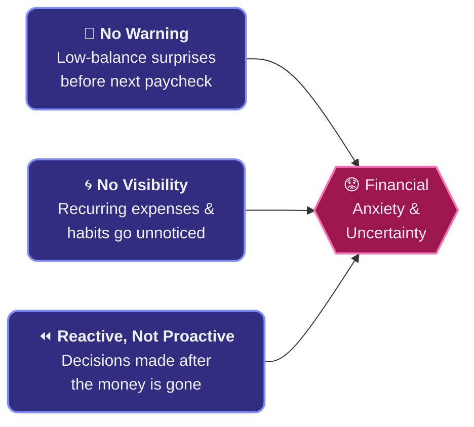
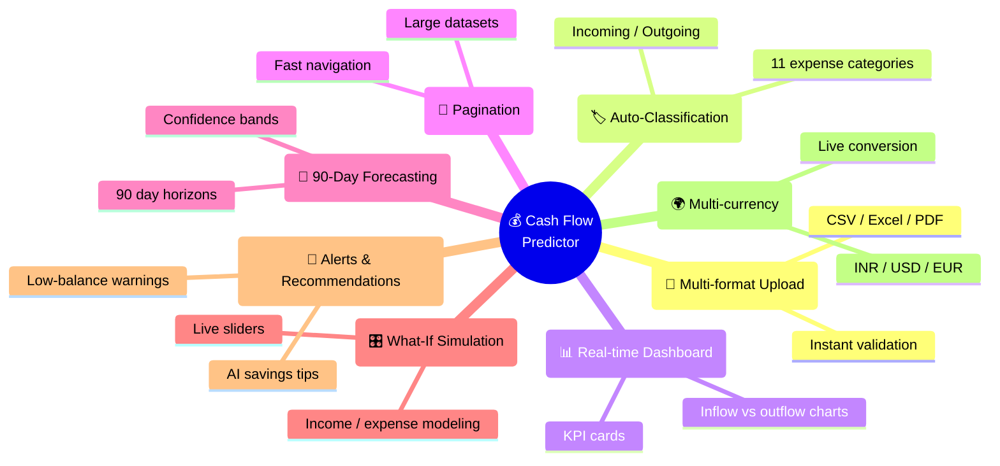
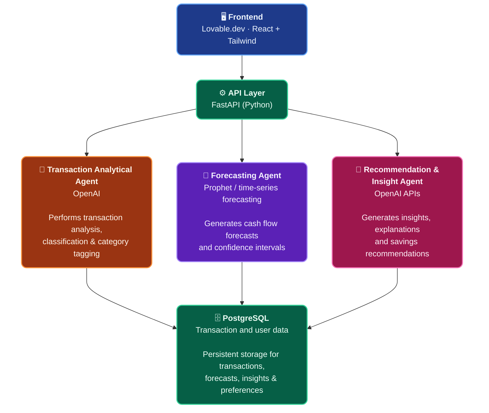
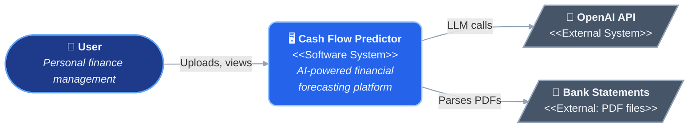
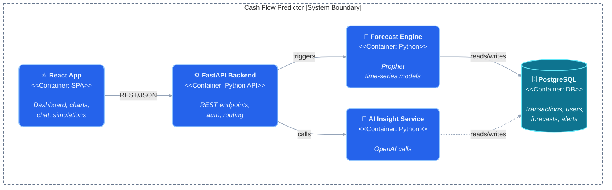
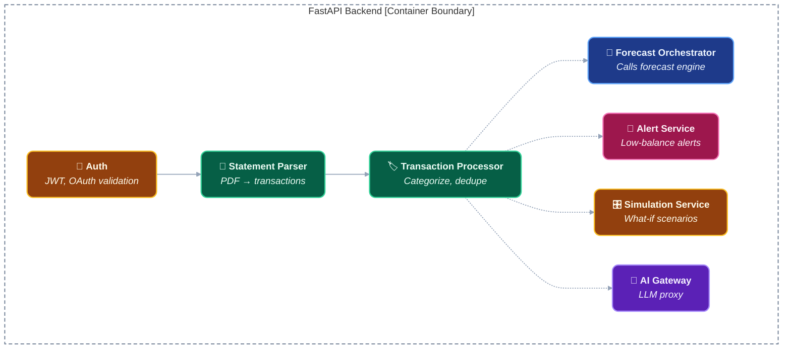
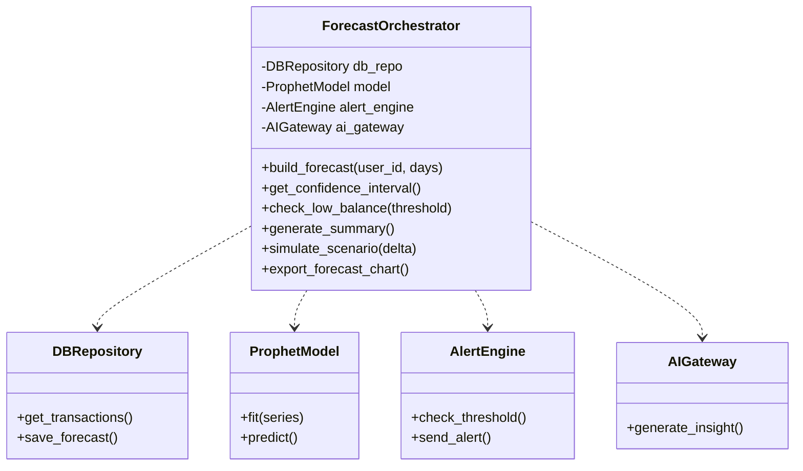
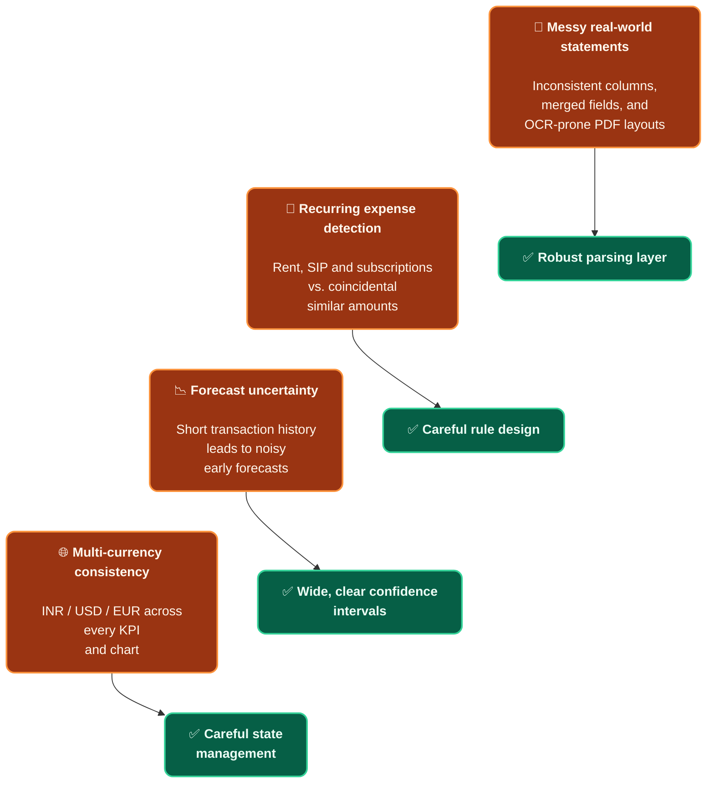
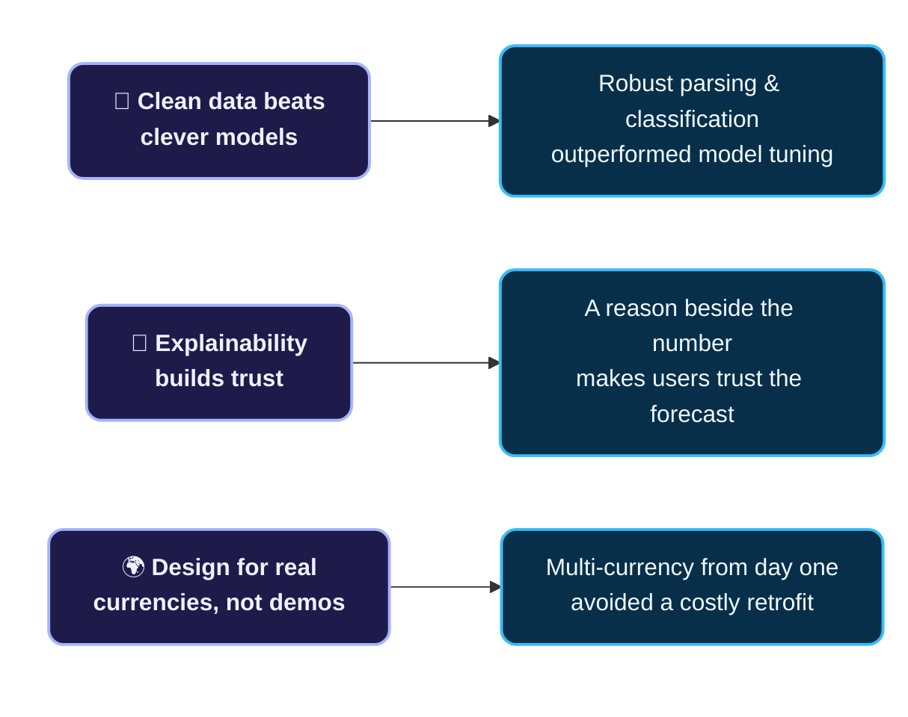

 

**AI-powered forecasting · Spending intelligence · Savings recommendations**

  
  
  
  

 

> Banking apps show what already happened. This project shows what's **about to happen** — and why.

## 🔗 Quick Navigation

**🎯 The Why**
- [Project Overview](#-project-overview)
- [Problem Statement](#-problem-statement)
- [Why It Matters](#-why-it-matters)

**🚀 The What**
- [Features](#-features)
- [Demo Walkthrough](#-demo-walkthrough)
- [Architecture](#️-architecture)

**🧠 The How**
- [Technology Stack](#️-technology-stack)
- [AI Components](#-ai-components)
- [Model Performance](#-model-performance--metrics)

  

- [Challenges Faced](#-challenges-faced)
- [What We Learned](#-what-we-learned)
- [Future Enhancements](#-future-enhancements)

 

---

 

## 🎯 Project Overview

Most people can't answer one simple question:

### 💭 *"Will I have enough money next month?"*

 

Banking apps show what already happened. Spreadsheets are manual and quickly go stale. Nothing connects past transactions to a forward-looking view of cash flow — **until now.**

> **Personal Cash Flow Predictor** closes that gap. Upload a bank statement, and the system automatically classifies every transaction, builds a 90-day balance forecast, and surfaces plain-language insights and savings opportunities — turning financial anxiety into financial confidence.

 

## 🧩 Problem Statement

| | Pain Point | Description |
|:---:|:---|:---|
| 💸 | **Low-balance surprises** | Unexpected shortfalls arrive before the next paycheck, with no warning. |
| 🌀 | **No visibility into patterns** | Recurring expenses and spending habits go unnoticed month after month. |
| ⏪ | **Reactive, not proactive** | Decisions get made after the money is already gone, not before. |

 

## ✨ Why It Matters

> Financial stress is rarely about income alone — it's about **uncertainty**. A forward-looking view turns financial anxiety into financial confidence.

<table>
<tr>
<td width="33%" align="center" valign="top">

### ⏱️
**Act before it's too late**

Forecasting low balances days in advance gives people time to adjust spending, not just react after an overdraft.

</td>
<td width="33%" align="center" valign="top">

### 🧮
**Save without the spreadsheet**

Automated pattern detection finds savings opportunities people would never spot manually.

</td>
<td width="33%" align="center" valign="top">

### 🌍
**Built for real life**

Supports multiple currencies and real bank statement formats, not just toy demo data.

</td>
</tr>
</table>

 

## 🚀 Features

<table>
<tr>
<td width="50%" valign="top">

#### 📂 Multi-format upload
Drag-and-drop CSV, Excel, or PDF bank statements, with instant column validation.

#### 🏷️ Automatic transaction classification
Every transaction tagged Incoming/Outgoing and sorted into 11 expense categories.

#### 📊 Real-time dashboard
KPI cards, inflow vs. outflow charts, and category breakdowns.

#### 📄 Pagination support
Large transaction datasets split into manageable pages for faster, smoother browsing.

</td>
<td width="50%" valign="top">

#### 🔮 90-day forecasting
Balance projections with confidence bands, supporting 30/90-day horizons.

#### 🎛️ What-if simulation
Sliders to model income changes, expense cuts, or one-time purchases live.

#### 🔔 Alerts & Recommendations
Automatic low-balance warnings and AI-generated savings recommendations.

#### 🌍 Multi-currency support
INR, USD, and EUR with live conversion.

</td>
</tr>
</table>

 

## 🎬 Demo Walkthrough

*The product flows through six stages, from raw statement to actionable insight.*

| Stage | What Happens |
|:---:|:---|
| 1️⃣ | **Upload** — Drag-and-drop a CSV, Excel, or PDF bank statement; columns are validated instantly. |
| 2️⃣ | **Auto-Classify** — Every transaction is tagged Incoming/Outgoing and sorted into 11 expense categories. |
| 3️⃣ | **Dashboard** — KPI cards, inflow vs. outflow charts, and a category breakdown update in real time. |
| 4️⃣ | **Forecast** — A 90-day forecast with confidence bands shows where the balance is headed. |
| 5️⃣ | **What-If** — Sliders simulate income changes, expense cuts, or one-time purchases live. |
| 6️⃣ | **Alerts & Recommendations** — Low-balance warnings and AI savings recommendations surface automatically. |

 

## 🏗️ Architecture

The system is organized as a clean pipeline: every transaction is classified (incoming/outgoing + category) automatically on upload, so forecasting and recommendations always work off clean, structured data.

> **Design principle:** Classify every transaction (incoming/outgoing + category) automatically on upload, so downstream forecasting and recommendations always operate on clean, structured data.

<table>
<tr>
<td width="50%" valign="top">

**🧠 Multi-Agent Architecture**

The system follows a multi-agent architecture where specialized agents handle transaction classification, forecasting, insight generation, and recommendation tasks independently while collaborating through the API layer.

</td>
<td width="50%" valign="top">

**📐 SDD (Spec-Driven Development)**

Requirements, workflows, and system behavior are defined through detailed specifications before implementation, improving consistency, scalability, and development efficiency.

</td>
</tr>
</table>

 

### 🧬 C4 Diagrams

*The architecture is documented at four levels of zoom — system context, containers, components, and code — following the C4 model.*

**Level 1 — System Context**

**Level 2 — Containers**

**Level 3 — Components (FastAPI Backend)**

**Level 4 — Code (ForecastOrchestrator)**

 

## 🛠️ Technology Stack

<table>
<tr><th align="left">Layer</th><th align="left">Technology</th></tr>
<tr><td>🎨 <b>Frontend</b></td><td>

</td></tr>
<tr><td>⚙️ <b>Backend</b></td><td>

</td></tr>
<tr><td>🗄️ <b>Database</b></td><td>

</td></tr>
<tr><td>📄 <b>Document Processing</b></td><td>

</td></tr>
<tr><td>🔮 <b>Forecasting</b></td><td>

</td></tr>
<tr><td>🤖 <b>AI</b></td><td>

</td></tr>
<tr><td>🧪 <b>API Testing</b></td><td>

</td></tr>
<tr><td>🚦 <b>Server</b></td><td>

</td></tr>
<tr><td>✅ <b>Testing</b></td><td>

</td></tr>
<tr><td>☁️ <b>Deployment</b></td><td>

</td></tr>
</table>

 

## 🤖 AI Components

<table>
<tr>
<td width="50%" valign="top">

#### 🔮 Forecasting Engine
Uses Prophet time-series models to project account balances 30 or 90 days into the future, with confidence bands that widen further out and narrow as new transactions arrive.

#### 💬 AI Insight Service
Uses OpenAI APIs to generate plain-language explanations of forecasts and personalized savings recommendations, so users understand *why* a forecast looks the way it does, not just the number itself.

</td>
<td width="50%" valign="top">

#### 🏷️ Transaction Classification
Automatically extracts and classifies every transaction into one of 11 expense categories on upload, forming the structured data foundation that forecasting and AI insights are built on.

#### 🎛️ Scenario Simulator
Uses natural-language inputs to evaluate "what-if" financial scenarios, generating an updated cash flow forecast, 90-day impact analysis, risk assessment, and actionable recommendations.

</td>
</tr>
</table>

 

## 📊 Model Performance & Metrics

> Model performance is evaluated using forecast accuracy, classification quality, prediction confidence intervals, and validation against historical transaction data.

| Metric | What It Measures | Our Model Performance |
|:---|:---|:---|
| 📏 **Mean Absolute Error (MAE)** | Average magnitude of forecast errors, in the same units as the balance itself | 5.0% of average balance |
| 📐 **Root Mean Squared Error (RMSE)** | Penalizes larger forecast misses more heavily than small ones | 7.0% of average balance |
| 🧮 **Mean Squared Error (MSE)** | Squared error term used internally for model tuning and comparison | 0.0049 |
| ⚖️ **Mean Absolute Scaled Error (MASE)** | Compares forecast error against a naive baseline, making accuracy comparable across users with different spending scales | 0.82 |

Illustrative placeholder values — pending real evaluation results.

 

## 🧗 Challenges Faced

| Challenge | How It Was Tackled |
|:---|:---|
| 🧾 **Messy real-world statements** | Bank PDFs vary wildly in layout; parsing had to handle inconsistent columns, merged fields, and OCR-prone formats. |
| 🔁 **Recurring expense detection** | Distinguishing genuine recurring charges (rent, SIP, subscriptions) from coincidentally similar amounts needed careful rule design. |
| 📉 **Forecast uncertainty** | Short transaction histories early on made early forecasts noisy; confidence intervals had to be wide and clearly communicated. |
| 🌐 **Multi-currency consistency** | Keeping every KPI, chart, and recommendation in sync across INR, USD, and EUR without mixed symbols took careful state management. |

 

## 💡 What We Learned

<table>
<tr>
<td width="33%" align="center" valign="top">

### 🧹
**Clean data beats clever models**

Time spent on robust parsing and classification paid off more than tuning the forecasting model itself.

</td>
<td width="33%" align="center" valign="top">

### 🤝
**Explainability builds trust**

Users trust a forecast more when it comes with a plain-language reason, not just a number.

</td>
<td width="33%" align="center" valign="top">

### 🌍
**Design for real currencies, not demos**

Building multi-currency support from day one avoided a costly retrofit later.

</td>
</tr>
</table>

 

## 🔮 Future Enhancements

<table>
<tr>
<td width="50%" valign="top">

#### 💬 Conversational financial assistant
Let users ask questions in plain English and get grounded answers from their own data.

#### 🚨 Anomaly detection
Flag unusual transactions automatically, beyond simple low-balance alerts.

#### 🏦 Multi-account support
Aggregate checking, savings, and credit accounts into one unified forecast.

</td>
<td width="50%" valign="top">

#### 🎯 Goal-based savings plans
Let users set a target (e.g. a trip or down payment) and get a tailored plan to reach it.

#### 📉 Subscription optimization
Surface underused subscriptions and suggest cancellations automatically.

</td>
</tr>
</table>

 

---

**Personal Cash Flow Predictor** · Team Project

🌟 *Built to turn financial anxiety into financial confidence* 🌟

